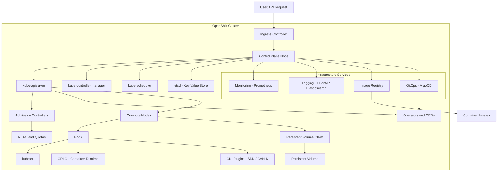

The diagram illustrates all major components of the **OpenShift architecture** and their relationships.
---

---

###  Highlights of the Architecture

* **Control Plane** (API server, scheduler, controller manager, etcd)
* **Compute Nodes** (Pods, kubelet, container runtime, CNI)
* **Infrastructure Services** (Monitoring, Logging, Registry, GitOps)
* **User interaction** via `Ingress Controller` → `API Server`
* **Operators** manage CRDs and automate applications
* **Persistent storage** mapped via PVCs/PVs

---

